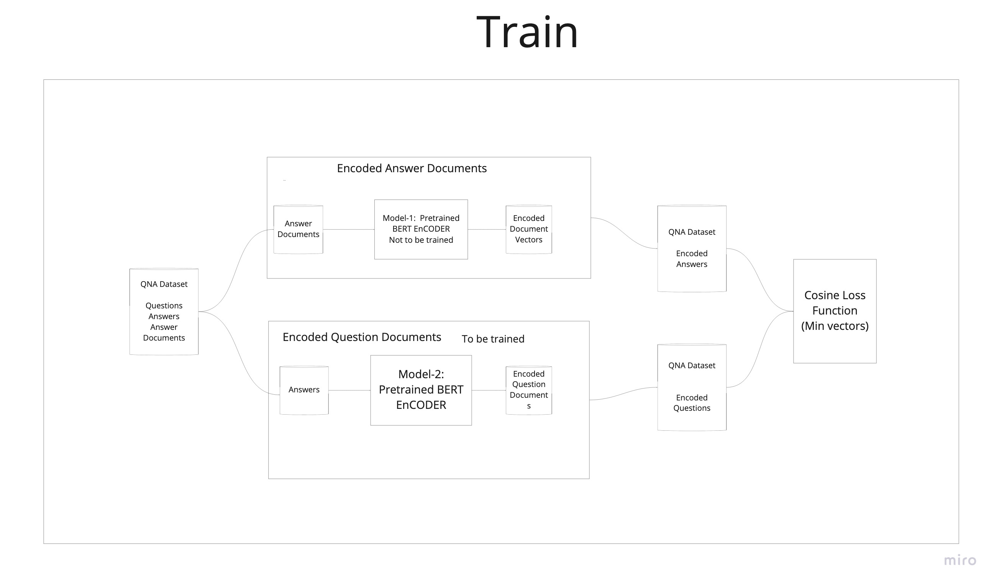

# END CapStone

# DOR Model

 - Two huggingface BERT base pretrained models for encoding Question and Answer
 - Cosine similarity loss function





# Code insight

Ensemble Model by combining two huggingface model

```
class EnsembleTokens(torch.nn.Module):
    def __init__(self):
        super(EnsembleTokens, self).__init__()
        self.question_model = BertModel.from_pretrained('bert-base-uncased')
        self.answer_model = BertModel.from_pretrained('bert-base-uncased')
    
    def forward(self, questions, answers):

        question_outputs = self.question_model(**questions)
        answer_outputs = self.question_model(**answers)

        return question_outputs, answer_outputs
```

## Loss Function

Example Loss
```
learning_rate = 5e-5
adam_epsilon=1e-8
no_decay = ['bias', 'LayerNorm.weight']
optimizer_grouped_parameters = [
    {'params': [p for n, p in model.named_parameters() if not any(nd in n for nd in no_decay)], 'weight_decay': 0.01},
    {'params': [p for n, p in model.named_parameters() if any(nd in n for nd in no_decay)], 'weight_decay': 0.0}
    ]
optimizer = AdamW(optimizer_grouped_parameters, lr=learning_rate, eps=adam_epsilon)

```