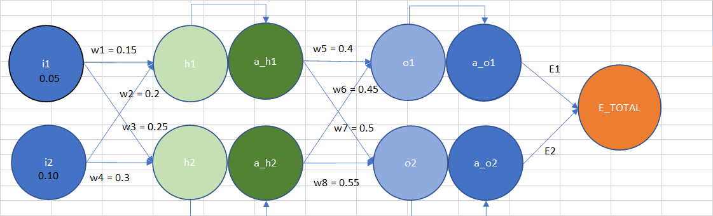
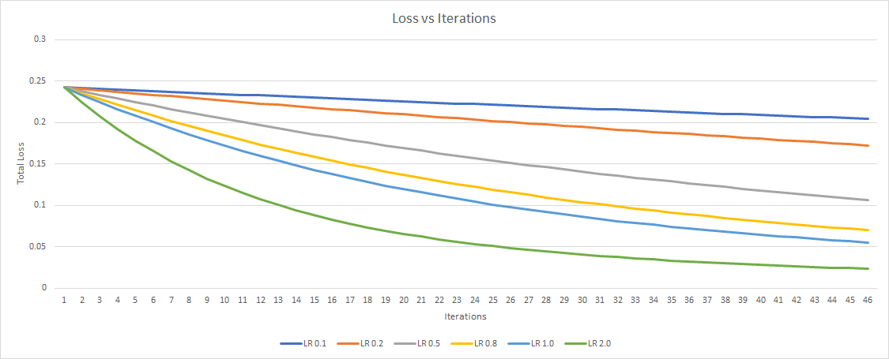
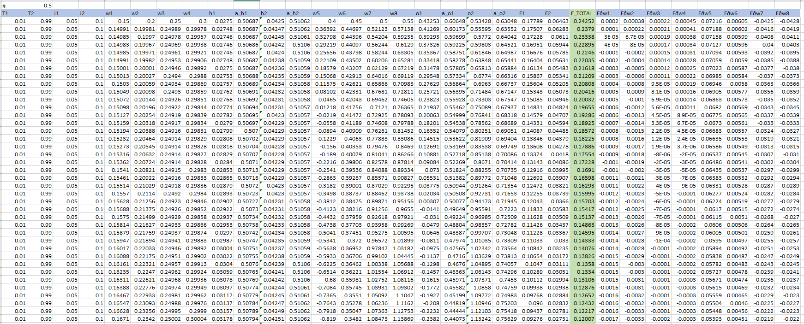

# Assignment 2 - Back Propagation

> Submitted by Naman Shrimali

## Target
Rewrite the whole excel sheet showing backpropagation. Explain each major step, and write it on Github. 
* Use exactly the same values for all variables as used in the class
* Take a screenshot, and show that screenshot in the readme file
* Excel file must be there for us to cross-check the image shown on readme (no image = no score)
* Explain each major step
* Show what happens to the error graph when you change the learning rate from [0.1, 0.2, 0.5, 0.8, 1.0, 2.0] 

## Mini Neural Network

This is our mini model !

### Key Features
It's a mini neural network, which
* Takes 2 inputs
* Has a total of 8 weights
* Does not have any biases 
* Uses ReLU as the activation function
* Uses Gradiant descent algorithm for updating weights
* Uses _L2_ Loss

## Results
The excel sheet uploaded in the repository contains in-depth calculations for learning rates 0.1, 0.2, 0.5, 0.8, 1.0, 2.0.


Total loss vs iterations


Calculation for Back Propagation for η 0.5


## Explaination
Before we can start with training of our mini model, it is important to get the forward propagation calculations sorted out. Then we can jump to back propagation !
### Formulas for forward propagation
```
i1, i2              : Inputs
o1, o2              : Outputs
h1, h2              : Neurons
a_h1, a_h2          : Activated Neurons (Neurons passed from activation function)
a_o1, a_o2          : Activated Outputs (Outputs passed from activation function)
w1, w2, .... , w8   : Weights
```
### Step 1 : Calculations for forward Propagation
```
h1 = i1 * w1 + i2 * w2		
h2 = i1 * w3 + i2 * w4		
a_h1 = σ(h1)		
a_h2 = σ(h2)		
o1 = a_h1 * w5 + a_h2* w6		
o2 = a_h1 * w7 + a_h2* w8		
a_o1 = σ(o1) => 1/(1+exp(-o1))		
a_o2 = σ(o2)		
E1 = ½ * (t1 - a_o1)2		
E2 = ½ * (t2 - a_o2)2		
E_TOTAL = E1 + E2		
```
### Step 2 : Calculating Partial Derivatives
Now that we've sorted our our calculations for forward propagation, let's jump to updation of weights (This is where things get interesting !)

In order to calculate updated weights, it's important to know the concept of [partial derivatives](https://www.khanacademy.org/math/multivariable-calculus/multivariable-derivatives/partial-derivative-and-gradient-articles/a/introduction-to-partial-derivatives)

*We essentially need to calculate the contribution of a single weight in the total loss of the entire neural network. Thus, our main objective in back propagation would be finding out this contribution, and subtracting with the original weight in order to reduce the total loss of the network* 

```
** A very intimidating partial differentiation of total loss with respect to w1 **

∂(E_Total)/∂w1 = ∂(E1+E2)/∂w1 
=> ∂E1/∂w1 + ∂E2/∂w1 
=> [(a_o1 - t1)* a_o1 * (1-a_o1) * w5 + (a_o2 - t2)* a_o2 * (1-a_o2) * w7] * [a_h1 * (1 - a_h1) * i1]
```

Please refer to the [excel file](https://github.com/nikshrimali/TSAI_END2_Phase1/blob/Assignment2-BackPropagation/Back%20Propagation%20Calculation.xlsx) in more detailed calculations

Similarly, we can calculate partial derivative of total loss wrt to each of the weight

```
∂(E_Total)/∂w2 = [(a_o1 - t1)* a_o1 * (1-a_o1) * w5 + (a_o2 - t2)* a_o2 * (1-a_o2) * w7] * [a_h1 * (1 - a_h1) * i2]														

∂(E_Total)/∂w3 = [(a_o1 - t1)* a_o1 * (1-a_o1) * w6 + (a_o2 - t2)* a_o2 * (1-a_o2) * w8] * [a_h2 * (1 - a_h2) * i1]														

∂(E_Total)/∂w4 = [(a_o1 - t1)* a_o1 * (1-a_o1) * w6 + (a_o2 - t2)* a_o2 * (1-a_o2) * w8] * [a_h2 * (1 - a_h2) * i2]														

∂(E_Total)/∂w5 = ∂E1/∂a_o1 * ∂a_o1/∂o1 * ∂o1/∂w5								

∂(E_Total)/∂w6 = ∂E1/∂a_o1 * ∂a_o1/∂o1 * ∂o1/∂w6

∂(E_Total)/∂w7 = ∂E2/∂a_o2 * ∂a_o2/∂o2 * ∂o2/∂w7								

∂(E_Total)/∂w8 = ∂E2/∂a_o2 * ∂a_o2/∂o2 * ∂o2/∂w8								
```	
### Step 3 : Updating weights !
Now that we've calculated partial derivatives of each of the weights wrt to total loss of the neural network, all we've to do is to negate the output of partial derivative _multiplied by the Learning Rate_ to the actual loss !

```
wn = wn - η * (∂(E_Total)/∂wn), where n is 1, 2, ... , 8
                                      η is learning rate
```
That's it ! Now all you've to do is to repeat steps 1 to 3 for appropriate number of iterations, and voila ! You've now trained your network ! 

Simple right ? No 😠 These are hard calculations ! It's much more complicated than i've shown

## What's next

I'm done :D

