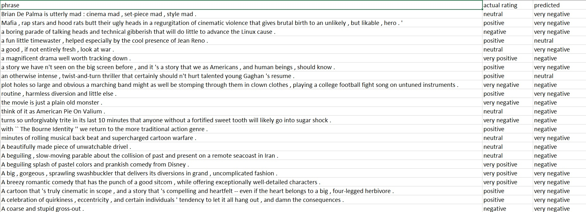
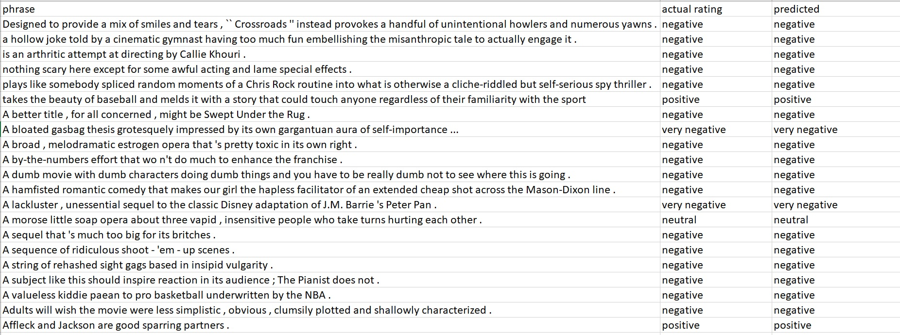

# Assignment 5 - Stanford Sentiment Analysis - Rotten Tomatoes

> Submitted by Nikhil Shrimali 

## Target:

* Look at [this code](https://colab.research.google.com/drive/19wZi7P0Tzq9ZxeMz5EDmzfWFBLFWe6kN?usp=sharing&pli=1&authuser=0) above. It has additional details on "Back Translate", i.e. using Google translate to convert the sentences. It has "random_swap" function, as well as "random_delete". 
* Use "Back Translate", "random_swap" and "random_delete" to augment the data you are training on
* Download the StanfordSentimentAnalysis Dataset from this [link](http://nlp.stanford.edu/~socherr/stanfordSentimentTreebank.zip) (it might be troubling to download it, so force download on chrome). Use "datasetSentences.txt" and "sentiment_labels.txt" files from the zip you just downloaded as your dataset. This dataset contains just over 10,000 pieces of Stanford data from HTML files of Rotten Tomatoes. The sentiments are rated between 1 and 25, where one is the most negative and 25 is the most positive.
* Train your model and achieve 65%+ validation/text accuracy. Upload your collab file on GitHub with readme that contains details about your assignment/word (minimum 500 words), training logs showing final validation accuracy, outcomes for 25 example inputs from the test/validation data and also find 10 false positives.
* You must submit before DUE date (and not "until" date).

## Submission
I have trained model, and observations, details can be found below. You can see detailed and step by step of explainination of every step in [this Jupyter Notebook](RottenTomatoesReviewAnalysis.ipynb) 

> Please note that the solution for this assignment was largely a disppointment, barely produced any results that I'd like to highlight. Infact, highlighting this highlight is itself a testment to the reader that what you're going to see in the readme won't be anything you'd like.


## Dataset
The `Stanford Sentiment Treebank (SST)` dataset was presented in “Recursive Deep Models for Semantic Compositionality Over a Sentiment Treebank” research from stanford in 2013. While I was not able to extract the complete sentences from this dataset, as it was (as the name suggests) in a tree structure. What I did was I took the phrases and made the dataset out of it. 
Read more about SST [here](https://towardsdatascience.com/the-stanford-sentiment-treebank-sst-studying-sentiment-analysis-using-nlp-e1a4cad03065).
Again, for detailed explaination over how I extracted the phrases from the given dataset, please refer [Jupyter Notebook](RottenTomatoesReviewAnalysis.ipynb)

> I also thought of constructing the dataset from [project pytreebank](https://pypi.org/project/pytreebank/), but since I couldn't understand the source code for this, I decided I'll use my best knowledge to attempt this assignment

### Data Cleaning
The phrase are not necessarily in correct english sentences, hence it is critical to clean this data. I removed extra characters at the begining of the phrase, only allowed phrases with length greater than 4

### Augmenting 
Now that we've saved the dataset into our physical memory, we'll apply augmentations (creating data out of data)
To do so, we'll be using the following augmentations:
* Back Translation - Paraphrasing the sentences, translating a sentence into an another language and converting back into english (source langauge). 
* Random Swap - Randomly swap words in the sentence
* Random Deletion - Randomly delete some of the words

Note : I modified the train csv file from google sheets to perform back translation as google translate api limits only 500 translations per day. The main motivation to read data from csv is because of this fact only.
```
[/usr/local/lib/python3.7/dist-packages/google_trans_new/google_trans_new.py](https://localhost:8080/#) in translate(self, text, lang_tgt, lang_src, pronounce)  192  except  requests.exceptions.HTTPError  as  e:  193  # Request successful, bad response  --> 194  raise  google_new_transError(tts=self,  response=r)  195  except  requests.exceptions.RequestException  as  e:  196  # Request failed  

google_new_transError: 429 (Too Many Requests) from TTS API. Probable cause: Unknown
```
You can find the augmented [training dataset](data\stt_train_with_aug.csv), [testing dataset](data\test.csv) and [validation dataset](data\validate.csv) inside the [data folder](data) in this repo

## Model
I've used an LSTM layer, with following parameters
* Embedding dimension : 50
* Number of hidden nodes : 100
* Number of output nodes : 5
* Number of layers : 2
* The model has total of 4,420,655 trainable parameters

### Summary
```
classifier(
  (embedding): Embedding(85571, 50)
  (encoder): LSTM(50, 100, num_layers=2, batch_first=True, dropout=0.5)
  (fc): Linear(in_features=100, out_features=5, bias=True)
)
```
## Training Parameters
* Optimizer : Adam
* Loss function : Cross Entropy Loss
* Dropout : 50%

## Observations
* The model, even with 
    * reducing embedding dimensions
    * reducing number of hidden nodes
    * increasing dropout to `50%` was extremly overfitting.
* Highest the training accuracy went was `86.39%`
* The testing accuracy ranged between 29%-30%, highest being `33.08%`
* Even after augmenting the dataset and increasing the data nearly `10 folds`, it did not have any affect on the testing accuracy.

## Results
Please find below code and screenshots of the misclassidfied images dataframe and correct classification dataframe saved as csv
```python
validset_iterator = validaion_dataframe.iterrows()
misclassified = pd.DataFrame(columns=['phrase', 'actual rating', 'predicted'])
correct_classified = pd.DataFrame(columns=['phrase', 'actual rating', 'predicted'])

# Iterating over the validation dataset and finding correct classified and misclassified images
for index, row in validset_iterator:
    predicted_rating = classify_review_comment(row['phrase'])
    if predicted_rating != row['overall sentiment']:
        misclassified = misclassified.append(
            pd.Series([
                row['phrase'], row['overall sentiment'], predicted_rating
            ], index = misclassified.columns), 
            ignore_index = True
        )
    else:
        correct_classified = correct_classified.append(
            pd.Series([
                row['phrase'], row['overall sentiment'], predicted_rating
            ], index = misclassified.columns), 
            ignore_index = True
        )
# Saving the dataframe into a csv file
misclassified.to_csv("output/misclassified.csv")
correct_classified.to_csv("output/correct_classified.csv")
```
### Misclassified

### Correct classified


You can find the [misclassified dataset](output\misclassified.csv) and [correct classified](output\correct_classified.csv) inside the [output folder](output)

## Conclusion
As you can see, the model learnt predicting everything as either very negative, negative or at best neutral, and thus achieved petty 30% testing accuracy. This model might represent the world view of a very famous person whose name rhymes with Purnub Coswami

## Future Aspirations
I won't be spending any time on this model now, and will continue to work on upcoming assignments. This model will forever be marked as one of my failures, and will be beacon of my humbelness if I achieve something in the field of AI. It would be then I'll make useless quips like "If I can do it, so can you". 
Also, still haven't given up on astronaut thing.