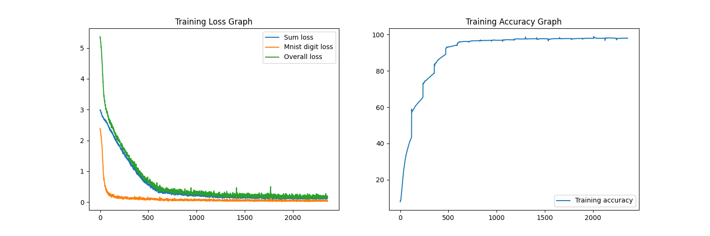
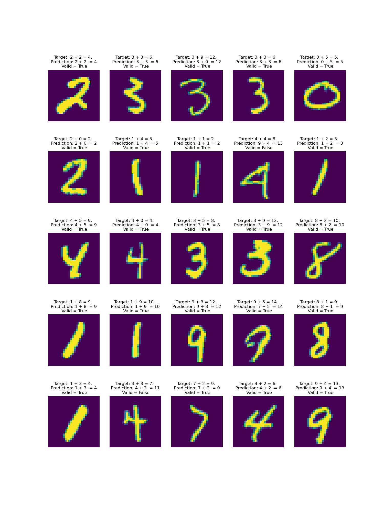

#  Assignment 3 - PyTorch

> Submitted by Nikhil Shrimali

## Target
* Write a neural network that can:
    * take 2 inputs:
        * an image from MNIST dataset, and
        * a random number between 0 and 9
    * and gives two outputs:
        * the "number" that was represented by the MNIST image, and
        * the "sum" of this number with the random number that
    * was generated and sent as the input to the network  
    * you can mix fully connected layers and convolution layers
    * you can use one-hot encoding to represent the random number input as well as the "summed" output. 

* Your code MUST be:
    * well documented (via readme file on github and comments in the code)
    * must mention the data representation
    * must mention your data generation strategy
    * must mention how you have combined the two inputs
    * must mention how you are evaluating your results
    * must mention "what" results you finally got and how did you evaluate your results
    * must mention what loss function you picked and why!
    training MUST happen on the GPU

* Once done, upload the code with shot training logs in the readme file from colab to GitHub, and share the GitHub link (public repository)

## Submission
I have trained model, summary and observationsd details can be found below.

---

### Model

```
----------------------------------------------------------------
        Layer (type)               Output Shape         Param #
================================================================
            Conv2d-1            [-1, 8, 28, 28]              72
              ReLU-2            [-1, 8, 28, 28]               0
       BatchNorm2d-3            [-1, 8, 28, 28]              16
            Conv2d-4           [-1, 16, 28, 28]           1,152
              ReLU-5           [-1, 16, 28, 28]               0
       BatchNorm2d-6           [-1, 16, 28, 28]              32
            Conv2d-7            [-1, 8, 28, 28]             136
         MaxPool2d-8            [-1, 8, 14, 14]               0
           Dropout-9            [-1, 8, 14, 14]               0
           Conv2d-10            [-1, 8, 14, 14]             576
             ReLU-11            [-1, 8, 14, 14]               0
      BatchNorm2d-12            [-1, 8, 14, 14]              16
           Conv2d-13           [-1, 16, 14, 14]           1,152
             ReLU-14           [-1, 16, 14, 14]               0
      BatchNorm2d-15           [-1, 16, 14, 14]              32
           Conv2d-16            [-1, 8, 14, 14]             136
        MaxPool2d-17              [-1, 8, 7, 7]               0
          Dropout-18              [-1, 8, 7, 7]               0
           Conv2d-19              [-1, 8, 7, 7]             576
             ReLU-20              [-1, 8, 7, 7]               0
      BatchNorm2d-21              [-1, 8, 7, 7]              16
           Conv2d-22             [-1, 16, 7, 7]           1,152
             ReLU-23             [-1, 16, 7, 7]               0
      BatchNorm2d-24             [-1, 16, 7, 7]              32
           Conv2d-25              [-1, 8, 7, 7]             136
        MaxPool2d-26              [-1, 8, 3, 3]               0
          Dropout-27              [-1, 8, 3, 3]               0
           Conv2d-28             [-1, 16, 1, 1]           1,152
           Conv2d-29             [-1, 10, 1, 1]             160
           Linear-30                   [-1, 20]             400
      BatchNorm1d-31                   [-1, 20]              40
             ReLU-32                   [-1, 20]               0
           Linear-33                   [-1, 19]             380
================================================================
Total params: 7,364
Trainable params: 7,364
Non-trainable params: 0
----------------------------------------------------------------
Input size (MB): 0.00
Forward/backward pass size (MB): 0.66
Params size (MB): 0.03
Estimated Total Size (MB): 0.69
----------------------------------------------------------------
```
---
### Dataset
Each item of the dataset contains:
* an image from MNIST Dataset, 
* a label for it,
* a one hot vector of a randomly generated number (1 x 19), 
* and sum of these two numbers

### Loss Function
There were two [cross entropy loss function](https://towardsdatascience.com/cross-entropy-loss-function-f38c4ec8643e) used, one for measuring loss for mnist handwritten image prediction, and one for measuring the summation of mnist and random digit output. The final loss function was the summation of the mentioned loss functions 
```
H1(y,y')= ∑[yi * log(1/y'i)] = −∑[yi * log(y'i)], where y & y' are model output for mnist digit and target label respectively

H2(x,x')= ∑[xj * log(1/x'j)] = −∑[xj * log(x'j)], where x & x' are model output for summation of two numbers and target sum respectively

T = H1 + H2 , where T is total loss of both the outputs
```
### Training
Created a training script for training the model. There are several parameters that you can specify for training
* number of epochs (--epochs)
* batch size (--batch-size)
* learning rate (--lr)
* Save the trained model (--save)
* Print the summary of model (--summary)
* Plot training and testing graphs (--plot-graph)
 
```python
python train.py --epochs 20 --batch-size 512 --lr 0.02 --save --summarize --plot-graph
```
### Inferencing
```python
python inference.py --total 25 
```
Mention how many images you need for inferencing. The images will be selected randomly from mnist dataset

(_You thought you can get output from your own image ? NO !! I won't give you the satisfaction of getting output from your own image._ 😈)

### Results
* No of parameters: 7,364
* No of epochs: 20
* Batch size: 512
* Dropout: 10%
* First training accuracies:  
    * Mnist Accuracy = 73.14% 
    * Sum_Accuracy = 13.48% 
    * Total : 43.31%
* First testing accuracies:
    * Mnist Accuracy: 95.28%
    * Sum Accuracy: 21.37%
    * Total: 58.33%
* Highest training accuracies:
    * Mnist Accuracy: 98.76%
    * Sum Accuracy: 97.43%
    * Total: 98.80%
* Highest testing accuracies:
    * Mnist Accuracy: 99.17%
    * Sum Accuracy: 98.49%
    * Total: 98.80%

**Training Graphs**

**Testing Graphs**

**Inferencing output**

---
## Future aspirations
* Is it too late to be an astronaut ?